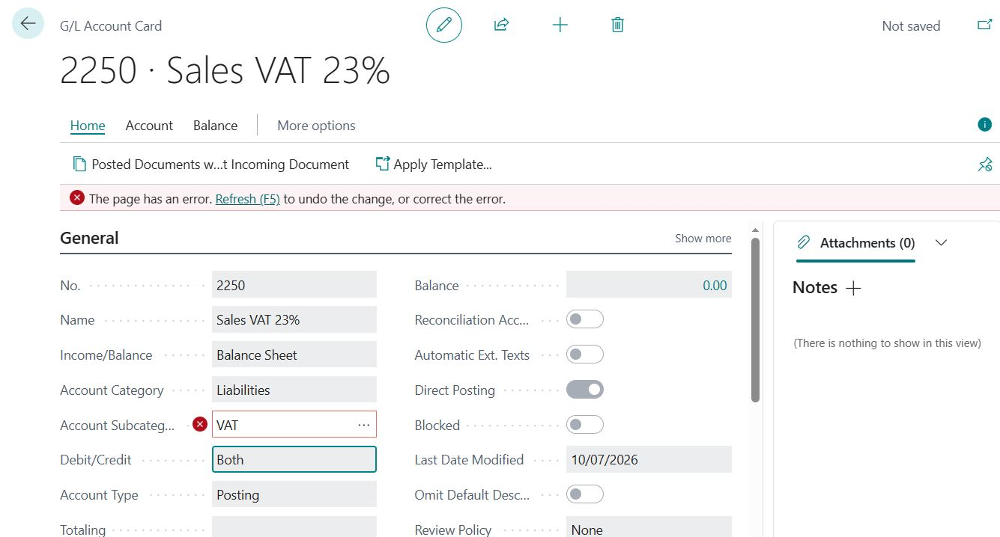
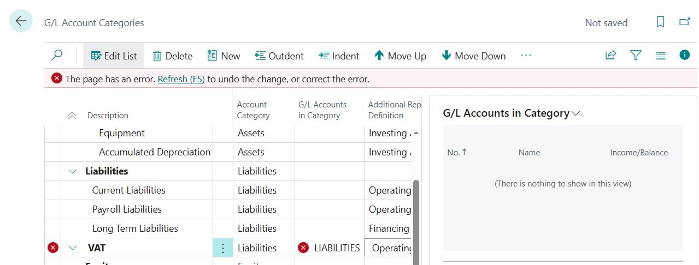
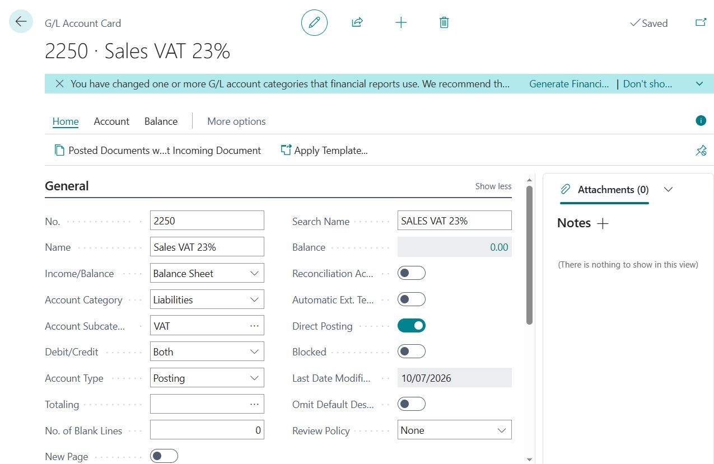
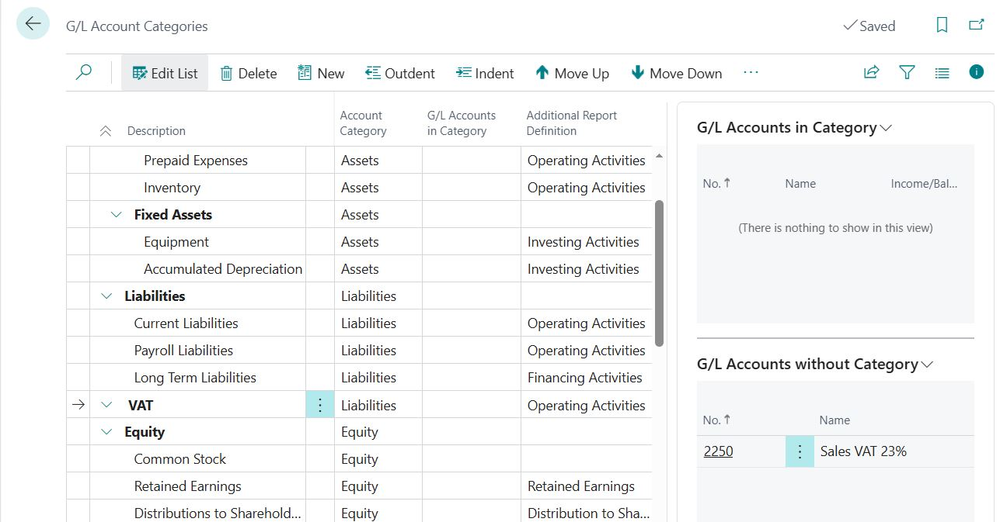
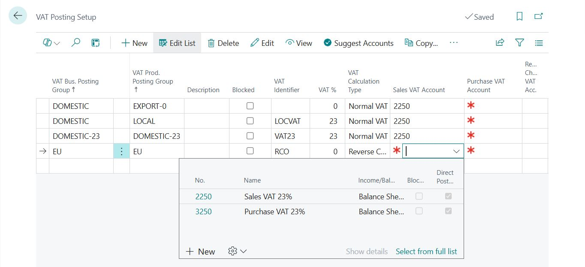

# Quadrent Case Study — VAT Posting Setup Configuration Error & Resolution
**System:** Dynamics 365 Business Central  
**Company:** Quadrent Sports Apparel (No‑Data Sandbox)  
**Module:** Financials → VAT Posting Setup  
**Author:** Hasan Farooqui  
**Date:** 10 July 2026  

---

| Field | Value |
|-------|-------|
| Environment | Business Central (No-Data Sandbox) |
| Module | Financials – VAT Posting Setup |
| Issue Type | Configuration / Validation Error |
| Priority | Medium |
| Status | Resolved |
| Resolution | Created required VAT G/L accounts, VAT subcategory, unique VAT identifiers, and completed VAT Posting Setup configuration |

---

## 1. Summary
During the initial configuration of VAT Posting Setup in a Business Central No-Data sandbox, several validation errors prevented the setup from being completed successfully. Investigation identified missing VAT G/L accounts, an undefined G/L Account Subcategory, and duplicate VAT Identifiers. 
This case study documents the investigation, root cause analysis, corrective actions, and final validation.

---

## 2. Background
A new Business Central No-Data sandbox was provisioned to simulate an initial ERP implementation. As no financial master data or VAT configuration existed, all VAT posting structures, G/L accounts, and supporting setup had to be configured manually before transactions could be posted.

This means:

- No VAT Posting Groups  
- No VAT Posting Setup  
- No VAT G/L Accounts  
- No Account Subcategories  
- No VAT Identifiers  

All VAT structure must be created manually.

---

## 3. Error Encountered

### 3.1 VAT Posting Setup Error
When creating VAT Posting Setup rows, Business Central displayed:

- Yellow notification bar  
- Inline red error icons  
- Missing VAT Identifier  
- Missing Sales VAT Account  
- Duplicate VAT Identifier conflict  

**Cause:**  
BC requires:

- Unique VAT Identifier per VAT %  
- Valid Sales VAT Account  
- Valid Purchase VAT Account  
- Valid Account Subcategory for VAT accounts  

These did not exist yet.

📸 **Screenshot 01 — VAT Posting Setup Error**  


---

### 3.2 G/L Account Card Error
When creating **2250 – Sales VAT 23%**, BC displayed:

- Red error icon beside **Account Subcategory: VAT**  
- Yellow bar indicating page validation failure  

**Cause:**  
The subcategory **VAT** did not exist under Liabilities.

📸 **Screenshot 02 — G/L Account Card Error**  


---

### 3.3 G/L Account Categories Error
Opening **G/L Account Categories** showed:

- VAT category missing  
- Red error icon  
- Yellow bar  
- Category incomplete (missing Additional Report Definition)

📸 **Screenshot 03 — G/L Account Categories Error**  


---

## 4. Investigation & Resolution

### 4.1 Create VAT G/L Accounts
Two VAT accounts were created:

| No. | Name | Category | Subcategory | Type |
|-----|-------|-----------|--------------|--------|
| **2250** | Sales VAT 23% | Liabilities | VAT | Posting |
| **3250** | Purchase VAT 23% | Liabilities | VAT | Posting |

📸 **Screenshot 04 — Validated G/L Account Card (2250)**  


---

### 4.2 Create Missing VAT Subcategory
In **G/L Account Categories**, a new category was added:

- **Description:** VAT  
- **Account Category:** Liabilities  
- **Additional Report Definition:** Operating Activities  

This resolved the G/L Account Card validation error.

📸 **Screenshot 05 — VAT Category Created & Validated**  


---

### 4.3 Correct VAT Posting Setup
Final VAT Posting Setup rows created:

| VAT Bus. PG | VAT Prod. PG | VAT % | VAT Identifier | Calc Type | Sales VAT | Purchase VAT |
|-------------|---------------|--------|----------------|------------|------------|----------------|
| DOMESTIC | EXPORT-0 | 0 | VAT0 | Normal VAT | 2250 | 3250 |
| DOMESTIC | LOCAL | 23 | LOCVAT | Normal VAT | 2250 | 3250 |
| DOMESTIC-23 | DOMESTIC-23 | 23 | VAT23 | Normal VAT | 2250 | 3250 |
| EU | EU | 0 | RCO | Reverse Charge | 2250 | 3250 |

### Resolution Outcome
Following completion of the required configuration, all VAT Posting Setup records validated successfully without further errors. Test posting scenarios confirmed that VAT calculations and G/L account mappings functioned as expected for domestic, export, and reverse-charge transactions.

📸 **Screenshot 06 — Final Validated VAT Posting Setup**  


---

## 5. Root Cause Analysis

| Issue | Root Cause | Resolution |
|-------|-------------|-------------|
| Missing VAT Identifier | No identifier created | Added unique identifiers (VAT23, VAT0, etc.) |
| Missing VAT Accounts | No G/L accounts existed | Created 2250 & 3250 |
| Missing VAT Subcategory | No VAT category under Liabilities | Created VAT category |
| Duplicate VAT Identifier | Same identifier used for different VAT % | Assigned unique identifiers |
| Page validation errors | Incomplete configuration | Completed all required fields |

The issue was caused by an incomplete financial configuration in a new Business Central environment. Required dependencies—including VAT G/L accounts, account subcategories, and unique VAT identifiers—must exist before VAT Posting Setup records can be validated and used for transaction posting.

---

## 6. Business Impact

### Before Fix
- VAT Posting Setup could not validate  
- Sales/Purchase transactions would fail  
- VAT calculation incorrect or blocked  
- Posting errors during invoicing  
- Financial reporting incomplete  

### After Fix
- VAT Posting Setup fully validated  
- Sales & Purchase VAT calculated correctly  
- Reverse Charge configured  
- G/L accounts mapped properly  
- System ready for transaction posting  

---

## 7. Key Learning
This exercise demonstrates practical Business Central functional support activities, including:

- Understanding VAT Posting Setup structure  
- Creating VAT accounts from scratch  
- Resolving validation errors  
- Configuring VAT for domestic, export, and EU scenarios  
- Documenting errors and resolutions professionally  

This exercise reinforced the dependencies between VAT Posting Setup, G/L Account configuration, and Account Categories within Business Central.

Key capabilities demonstrated include:

- Functional troubleshooting of configuration errors
- Root cause analysis
- Financial configuration in a new Business Central environment
- Validation of VAT Posting Setup
- Documentation of investigation and resolution steps

---

## 8. Prevention

To avoid similar issues in future Business Central deployments:

- Configure VAT-related G/L accounts before creating VAT Posting Setup entries.
- Ensure required G/L Account Categories and Subcategories are available.
- Use unique VAT Identifiers for each VAT percentage.
- Validate configuration before testing sales or purchase transactions.

## 9. Files & Evidence

```text
/02-Support-Case-Studies/04-VAT-Posting-Setup-Error/
│
├── 01_Error.JPG
├── 02_GLAccount_Error.JPG
├── 03_GLCategory_Error.JPG
├── 04_GLAccount_Resolved.JPG
├── 05_VATCategory_Resolved.JPG
└── 06_Final_VATPostingSetup.JPG
```

---

## 10. Status
✅ **Completed**  
System validated and ready for VAT‑related posting scenarios.


